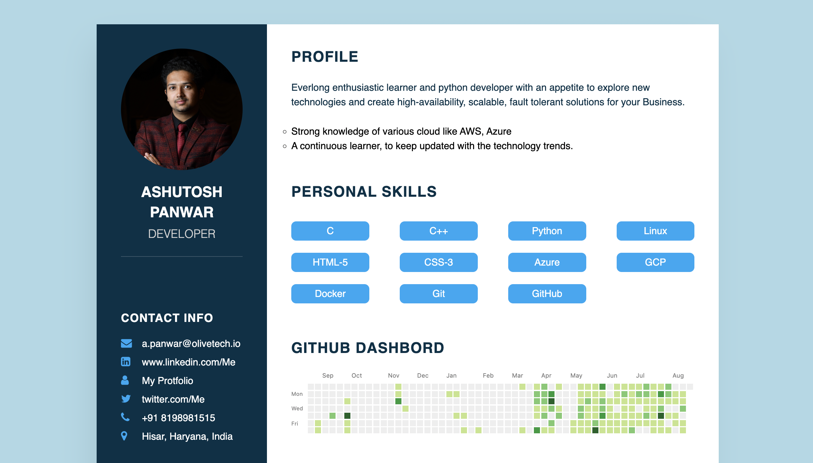

<p align="center"> 
    </img>
</p>

<h1 align="center"> 🔥Ashutosh Panwar Resume 🔥 </h1> 
<h3 align="center"> A clean, beautiful, responsive resume ! </h3>

<p align="center">If you like my work, You can follow me on <a href="https://www.linkedin.com/in/ashutosh-panwar1100/">LinkedIn</a>,<a href="https://twitter.com/Ashu_Panwar1100"> Twitter</a>.</p>

# Sections 🌈

✔️ About me\
✔️ Skills \
✔️ Github Dashbord\
✔️ Certifications 🏆\
✔️ Education\
✔️ Contact me

To view a live example, **[click here](http://ashutoshpanwar.me/Resume/)**

# Clone and Use ✏️

-   The website is completely built on `HTLM5`,`CSS3` and `javascript`
-   Just simply copy and paste the command below in you terminal:
    ```bash
     git clone https://github.com/AshutoshPanwar/Resume.git
    ```
    This will clone the whole repository in your system.
-   Now the project is ready to use
-   Browse inside the folder and click on index.html file

# Deployment 📦

-   This WebSite is hosted on GitHub Pages
-   I highly recommend using [Github Pages] to achieve this the EASIEST WAY.

# Technologies used 🛠️

-   HTML5
-   CSS3
-   Js
